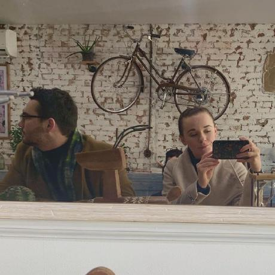

    
    <h1 class="display-5 fw-bold">Hey There</h1>
    

      
I'm Nate. This is my personal website. I'm a Ph.D. student in Economics with a side interest in web programming. The pic above is of my wife and me in New York. See below for more about me.

      

        <a href="about" type="button" class="btn btn-primary btn-lg px-4 gap-3">Bio</a>
        <a href="cv" type="button" class="btn btn-outline-secondary btn-lg px-4">CV</a>
      

    

  
